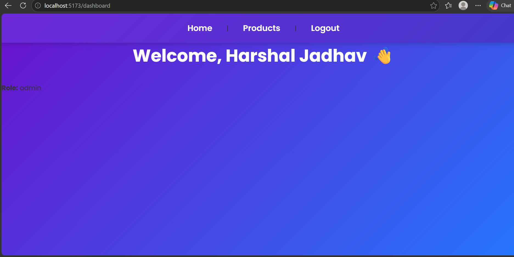

Product Management App

📌 Project Description

A full-stack Product Management Application built with React.js, Node.js, Express.js, and MongoDB.

The application includes user authentication, JWT-based authorization, role-based access control, product management, dashboard functionality, user management, and profile update features.

Users can sign up, log in, access their dashboard, view products, view product details, and update their profile. Admin users can access the Users page and view all registered users.

---

📸 Screenshots

Login Page

(./)

Dashboard

"Dashboard" (./)

---

🛠️ Tech Stack

Frontend

- React.js
- React Router DOM
- Axios
- CSS
- Vite

Backend

- Node.js
- Express.js
- MongoDB
- Mongoose
- JWT Authentication
- bcryptjs

Security

- Helmet
- CORS
- Express Rate Limit
- JWT Authentication
- Role-Based Authorization

Tools

- VS Code
- Postman
- MongoDB Atlas
- Git
- GitHub

---

✨ Features

- User Signup
- User Login
- JWT-based authentication
- Protected routes
- Logout functionality
- Dashboard with user's name and role
- Admin-only Users page
- Users table with pagination
- Profile name update
- Product listing
- Product detail page
- Role-based access control
- Password hashing
- Helmet security headers
- CORS configuration
- Rate limiting
- Request logging
- Request ID middleware
- 404 error handling
- Global error handling

---

🚀 Setup Instructions

Backend Setup

1. Clone the repository:

git clone YOUR_GITHUB_REPOSITORY_URL

2. Go to the backend folder:

cd day12-express-mvc

3. Install dependencies:

npm install

4. Create a ".env" file in the backend folder:

PORT=5001
MONGO_URI=your_mongodb_connection_string
JWT_SECRET=your_jwt_secret

5. Start the backend server:

npm run dev

Backend URL:

http://localhost:5001

---

Frontend Setup

1. Open a new terminal.

2. Go to the frontend folder:

cd day19-react

3. Install dependencies:

npm install

4. Start the frontend:

npm run dev

Frontend URL:

http://localhost:5173

---

🔗 API Endpoints

Method| Endpoint| Description| Authentication
POST| "/api/auth/signup"| Register a new user| Public
POST| "/api/auth/login"| Login user| Public
GET| "/api/auth/users"| Get all users| Admin only
GET| "/api/products"| Get all products| Authenticated
GET| "/api/products/:id"| Get product by ID| Authenticated
POST| "/api/products"| Create a product| Authenticated
PUT| "/api/products/:id"| Update a product| Authenticated
DELETE| "/api/products/:id"| Delete a product| Admin only

---

⚠️ Known Issues / Future Improvements

- Improve responsive design for all screen sizes.
- Add better form validation.
- Add search and advanced filtering.
- Improve error messages and user feedback.
- Add automated testing.
- Add refresh token functionality.
- Improve UI/UX design.

---

👩‍💻 Author

Gayatri Jadhav

MERN Stack Training Project.
